# FENCINGLY

### What we extract from a fencing clip, what each piece is worth, and the videos that show it

We are trying to learn **who has right of way** in a foil action. Foil is a weapon of *convention*:
the valid touch is not simply the first one to land, so the answer **cannot be read off the scoring
lights**. That is the whole reason this project exists - and it is the one thing that does not work
yet: our detector scores **69.7 %** against **73.8 % for never answering at all**, so it ships
**off**. It is in the capability table below with that number next to it, and this page is about
everything that *is* extracted along the way.

Everything below is **generated by us** from the clips: skeletons, masks, normals, alphas, threat
cones, piste maps. Every video and every figure on this page comes out of the pipeline - 38
videos in all - and each one carries **its measured error printed on the frame**, not just its name.

---

## Credit and thanks

### The clips come from FencingDatabase - **https://fencingdatabase.com/**

**Thank you to the [FencingDatabase](https://fencingdatabase.com/) team for letting us use their
clips.** Without that corpus none of what follows exists: it is the only place where thousands of
foil touches are collected, cut and searchable, and building it from scratch was never an option for
us. If you work on fencing video, start there: **[fencingdatabase.com](https://fencingdatabase.com/)**.

---

## The whole thing in one frame

Top left, the two skeletons on the clip with each fencer's position in metres. Under them, the label with **what each fencer is doing right now** - march, retreat, lunge, halt. On the right, the **trace**: position along the piste against time. Along the bottom, the **piste from above**, to scale, with each fencer's trail behind them and the events appearing as they happen.

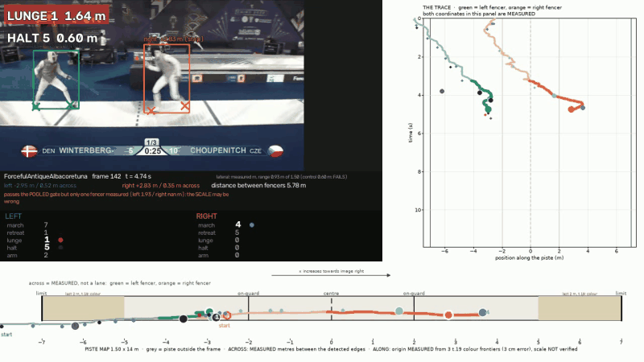

*10 s, generated over the clip. Everything below is one layer at a time, with what it is worth next to it.*

---


## What is extracted, layer by layer

Every video below is the **same clip**, one layer at a time, at the clip's own frame rate. The label
on each frame says what you are looking at and what it measured.

### How a pose gets found: four rounds, and what each one recovers

A pose is not simply *detected or not*. There are four rounds, and **each one is counted separately** so you can see what would be missing without it.

**The pose is Sapiens 2 in every round.** What changes between rounds is **where the box comes from**: YOLO gives only the box, and the 308 points are always measured by the same pose head. Round 2 exists because that head is **top-down** - it needs no detector to confirm the person, only a box - so it can try exactly where the detector already failed twice. Round 3 is the only one with no measurement left in it.

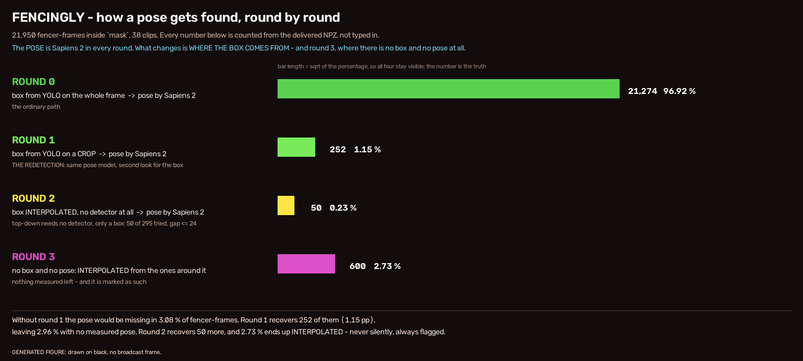

| round | where the **box** comes from (the pose is always Sapiens 2) | recovers | of 21,950 fencer-frames |
|---|---|---:|---:|
| **0** | YOLO on the whole frame | 21,274 | 96.92 % |
| **1** | **YOLO again, on a crop** - the redetection | 252 | 1.15 % |
| **2** | **interpolated box, no detector at all** | 50 | 0.23 % |
| **3** | no box and no pose: **the pose itself is interpolated** | 600 | 2.73 % |

Read it as a cascade: **without round 1 the pose would be missing in 3.08 %** of fencer-frames. Round 1 - the redetection - recovers **252 of them**, leaving **2.96 %** with no measured pose. Round 2 recovers **50 more**, and what is left, **2.73 %**, is interpolated and **carries a flag saying so**.

Round 2 is only attempted where the gap is **24 frames or shorter** (50 of 295 cases). Beyond that it is not a tuning problem: the quality gate passes **0.6 %** of the time with a fencer in the box and **12.7 %** on an empty patch of background, so it does not discriminate at all - the fencer is simply not in those frames.

**A redetection you can look at.** Left: the full frame, with the box where the detector found nobody. Right: the same box as a crop, where the pose came out.

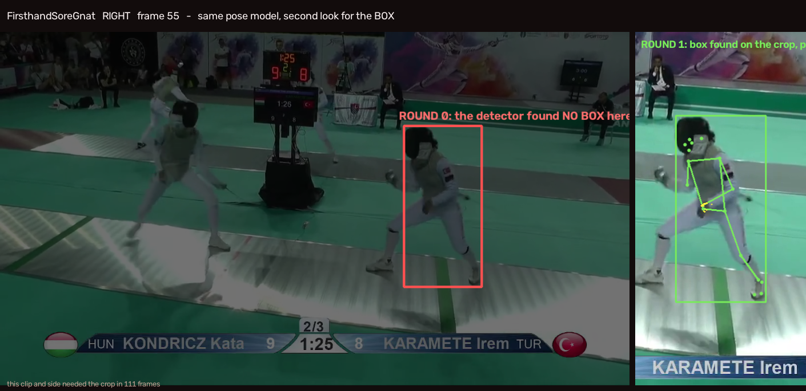
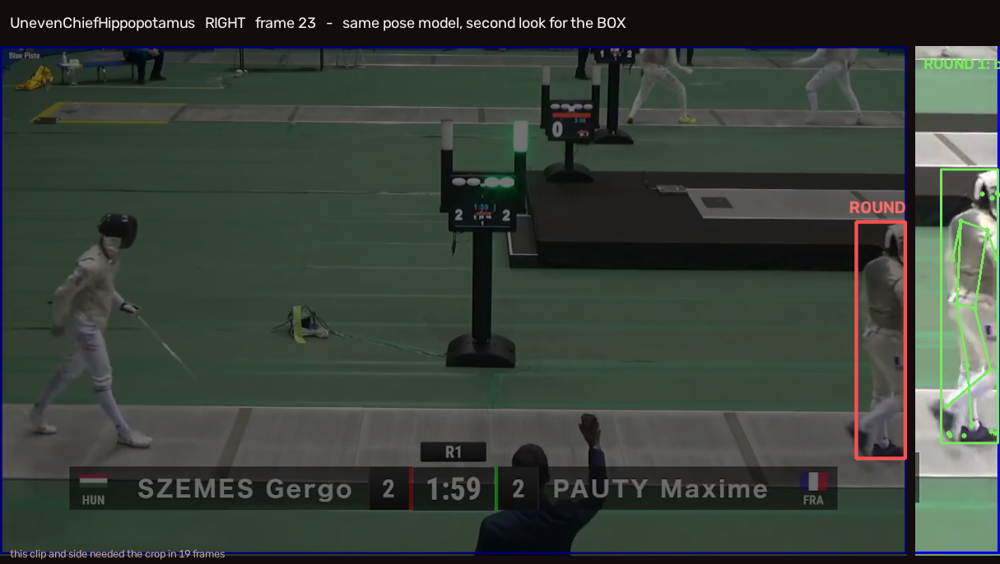


### 1 - POSE: 308 keypoints per fencer

Two fencers, 308 points each, every frame. Green is side 0 (image left), orange is side 1. A red box is a person the detector found and we **did not** select. The insets at the bottom are the weapon hand at native resolution, because each hand is 21 of those 308 points and at full frame they are a blur.

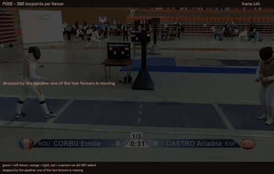

*8 s of the layer, 720 px. The MP4 below is the whole clip at full resolution - the GIF is here because GitHub does not play the video.*

<video src="https://huggingface.co/datasets/EXCALORIO/fencingly-datos/resolve/main/media/pose_BabyishIdioticCockerspaniel.mp4" controls loop muted playsinline width="100%"></video>

[pose_BabyishIdioticCockerspaniel.mp4 - MP4, 3.1 MB](media/pose_BabyishIdioticCockerspaniel.mp4)

<video src="https://huggingface.co/datasets/EXCALORIO/fencingly-datos/resolve/main/media/pose_proudDungBeetleBoglenTerrier.mp4" controls loop muted playsinline width="100%"></video>

[pose_proudDungBeetleBoglenTerrier.mp4 - MP4, 3.6 MB](media/pose_proudDungBeetleBoglenTerrier.mp4)

More clips, same layer: [uptightSlothEveningBat](media/pose_uptightSlothEveningBat.mp4)


Full-resolution stills:

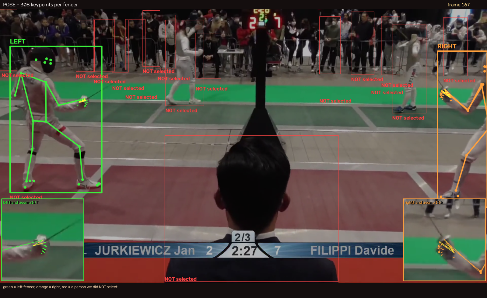
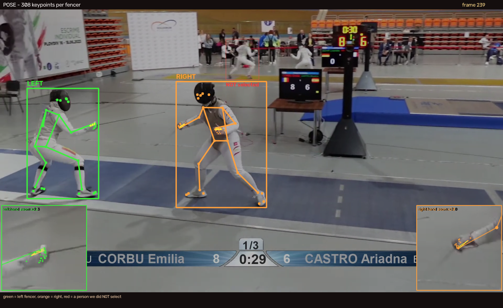

More stills, same layer: [BabyishIdioticCockerspaniel_c0302](media/pose_BabyishIdioticCockerspaniel_c0302.png) | [BabyishIdioticCockerspaniel_c0315](media/pose_BabyishIdioticCockerspaniel_c0315.png) | [proudDungBeetleBoglenTerrier_c0096](media/pose_proudDungBeetleBoglenTerrier_c0096.png) | [proudDungBeetleBoglenTerrier_c0163](media/pose_proudDungBeetleBoglenTerrier_c0163.png) | [proudDungBeetleBoglenTerrier_c0230](media/pose_proudDungBeetleBoglenTerrier_c0230.png) | [proudDungBeetleBoglenTerrier_c0334](media/pose_proudDungBeetleBoglenTerrier_c0334.png) | [uptightSlothEveningBat_c0146](media/pose_uptightSlothEveningBat_c0146.png) | [uptightSlothEveningBat_c0187](media/pose_uptightSlothEveningBat_c0187.png) | [uptightSlothEveningBat_c0227](media/pose_uptightSlothEveningBat_c0227.png) | [uptightSlothEveningBat_c0303](media/pose_uptightSlothEveningBat_c0303.png) | [uptightSlothEveningBat_c0362](media/pose_uptightSlothEveningBat_c0362.png)


- **2.26 px** torso error from running the pose at 384x288 instead of 1024, which is **7.8x** cheaper
- **96.0 %** of delivered poses are measured; the rest are interpolated and **say so**
- **0 held poses**: a held pose is the same pose repeated, and it would look like a fencer standing still
- **10,140** keypoints were landing outside their own person's box - on the other fencer - and are now zeroed
- there is **no wrist index** in this map: the wrist **is** the hand root. The map was measured, not read off a datasheet
- **the invented poses can be partly replaced by measured ones, and this was just measured.** Of the **650** invented poses in 38 clips (2.96 % of delivered fencer-frames, all of them interpolated - `held` is **0** everywhere), re-running the pose head alone on that exact frame recovers a valid measured pose in **50 of the 295** whose gap is <= 24 frames. In a control where fully measured frames were hidden and re-measured, the rescue costs **1.94 %** of torso length against **21.02 %** for interpolating, and it is closer to the truth in **98.2 %** of 626 cases
- **and for gaps of 25 frames or more it does not work, which is the useful half of that result**: only **2 of 355** pass the quality gate, while an **empty patch of background** in the same frame passes **45 of 355**. The rescue finds a fencer in the estimated box *less often than in a piece of floor*, because **the fencer is not in those frames at all**. So *beyond 24 frames there is no measurement* is not a tuning problem, and those 355 - **54.6 % of everything invented** - stay unverifiable

### 2 - SEG: body-part segmentation

The cleaned mask, blended **only inside itself**. Outside it the frame is just darkened, which is deliberate: that is how you can check the mask landed on the right person instead of on the referee walking past.

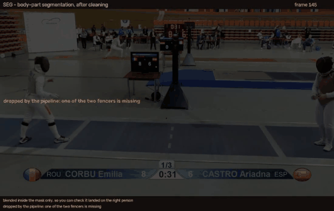

*8 s of the layer, 720 px. The MP4 below is the whole clip at full resolution - the GIF is here because GitHub does not play the video.*

<video src="https://huggingface.co/datasets/EXCALORIO/fencingly-datos/resolve/main/media/seg_BabyishIdioticCockerspaniel.mp4" controls loop muted playsinline width="100%"></video>

[seg_BabyishIdioticCockerspaniel.mp4 - MP4, 2.1 MB](media/seg_BabyishIdioticCockerspaniel.mp4)

<video src="https://huggingface.co/datasets/EXCALORIO/fencingly-datos/resolve/main/media/seg_proudDungBeetleBoglenTerrier.mp4" controls loop muted playsinline width="100%"></video>

[seg_proudDungBeetleBoglenTerrier.mp4 - MP4, 2.4 MB](media/seg_proudDungBeetleBoglenTerrier.mp4)

More clips, same layer: [uptightSlothEveningBat](media/seg_uptightSlothEveningBat.mp4)


Full-resolution stills:

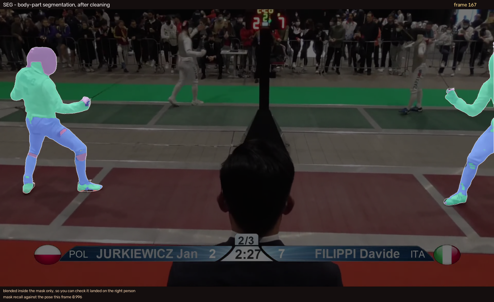
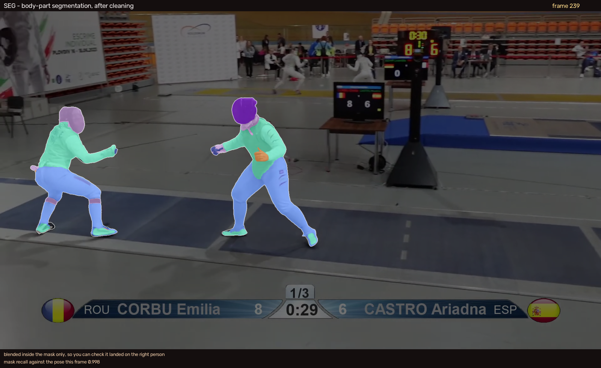

More stills, same layer: [BabyishIdioticCockerspaniel_c0302](media/seg_BabyishIdioticCockerspaniel_c0302.png) | [BabyishIdioticCockerspaniel_c0315](media/seg_BabyishIdioticCockerspaniel_c0315.png) | [proudDungBeetleBoglenTerrier_c0096](media/seg_proudDungBeetleBoglenTerrier_c0096.png) | [proudDungBeetleBoglenTerrier_c0163](media/seg_proudDungBeetleBoglenTerrier_c0163.png) | [proudDungBeetleBoglenTerrier_c0230](media/seg_proudDungBeetleBoglenTerrier_c0230.png) | [proudDungBeetleBoglenTerrier_c0334](media/seg_proudDungBeetleBoglenTerrier_c0334.png) | [uptightSlothEveningBat_c0146](media/seg_uptightSlothEveningBat_c0146.png) | [uptightSlothEveningBat_c0187](media/seg_uptightSlothEveningBat_c0187.png) | [uptightSlothEveningBat_c0227](media/seg_uptightSlothEveningBat_c0227.png) | [uptightSlothEveningBat_c0303](media/seg_uptightSlothEveningBat_c0303.png) | [uptightSlothEveningBat_c0362](media/seg_uptightSlothEveningBat_c0362.png)


- referee leakage into the mask measured **0.0000**
- the mask is `(matting >= 0.5 OR seg != background) AND nearest-skeleton AND box guard`, and the loss is attributed to the three of them separately - a low recall does not say what to fix
- stored **per crop**, not per frame: the two masks cover **4.6-4.8 %** of the frame, so full-frame storage would waste 21x

### 3 - NORMAL: surface normals

One axis per colour channel. This is the dense layer that **does** hold up for local geometry.


*8 s of the layer, 720 px. The MP4 below is the whole clip at full resolution - the GIF is here because GitHub does not play the video.*

<video src="https://huggingface.co/datasets/EXCALORIO/fencingly-datos/resolve/main/media/normal_BabyishIdioticCockerspaniel.mp4" controls loop muted playsinline width="100%"></video>

[normal_BabyishIdioticCockerspaniel.mp4 - MP4, 2.1 MB](media/normal_BabyishIdioticCockerspaniel.mp4)

<video src="https://huggingface.co/datasets/EXCALORIO/fencingly-datos/resolve/main/media/normal_proudDungBeetleBoglenTerrier.mp4" controls loop muted playsinline width="100%"></video>

[normal_proudDungBeetleBoglenTerrier.mp4 - MP4, 2.4 MB](media/normal_proudDungBeetleBoglenTerrier.mp4)

More clips, same layer: [uptightSlothEveningBat](media/normal_uptightSlothEveningBat.mp4)


Full-resolution stills:

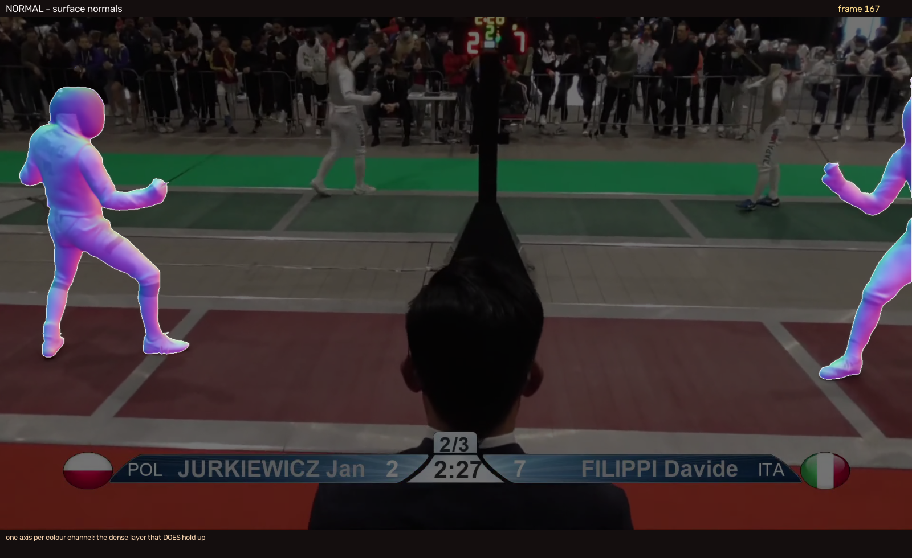
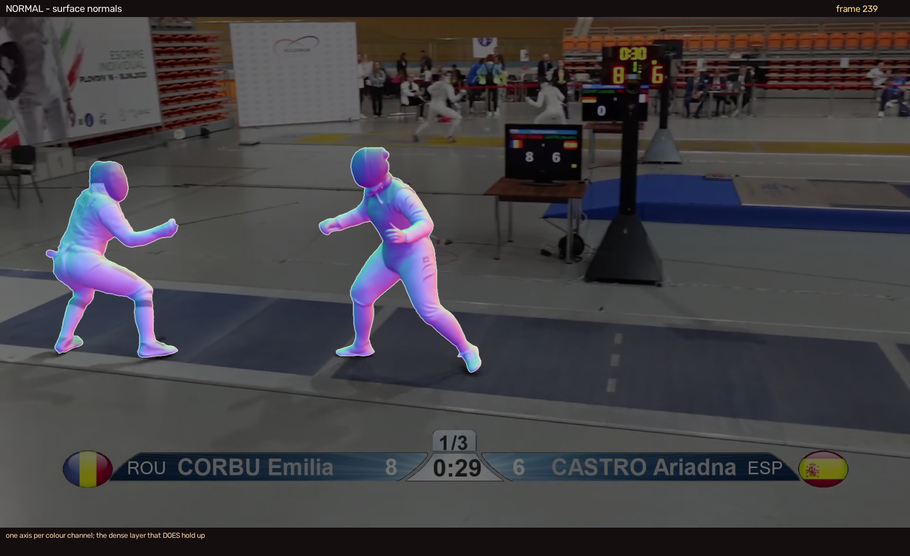

More stills, same layer: [BabyishIdioticCockerspaniel_c0302](media/normal_BabyishIdioticCockerspaniel_c0302.png) | [BabyishIdioticCockerspaniel_c0315](media/normal_BabyishIdioticCockerspaniel_c0315.png) | [proudDungBeetleBoglenTerrier_c0096](media/normal_proudDungBeetleBoglenTerrier_c0096.png) | [proudDungBeetleBoglenTerrier_c0163](media/normal_proudDungBeetleBoglenTerrier_c0163.png) | [proudDungBeetleBoglenTerrier_c0230](media/normal_proudDungBeetleBoglenTerrier_c0230.png) | [proudDungBeetleBoglenTerrier_c0334](media/normal_proudDungBeetleBoglenTerrier_c0334.png) | [uptightSlothEveningBat_c0146](media/normal_uptightSlothEveningBat_c0146.png) | [uptightSlothEveningBat_c0187](media/normal_uptightSlothEveningBat_c0187.png) | [uptightSlothEveningBat_c0227](media/normal_uptightSlothEveningBat_c0227.png) | [uptightSlothEveningBat_c0303](media/normal_uptightSlothEveningBat_c0303.png) | [uptightSlothEveningBat_c0362](media/normal_uptightSlothEveningBat_c0362.png)


- outside the mask the value is **NaN and not 0**, because the zero vector is not a unit normal but it would average silently inside a convolution

### 4 - MATTING: alpha, the soft silhouette

The soft silhouette. At very low alpha the **edge of the blade** appears, and that is what the foil detector works on.

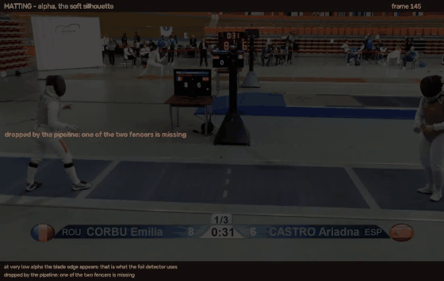

*8 s of the layer, 720 px. The MP4 below is the whole clip at full resolution - the GIF is here because GitHub does not play the video.*

<video src="https://huggingface.co/datasets/EXCALORIO/fencingly-datos/resolve/main/media/matting_BabyishIdioticCockerspaniel.mp4" controls loop muted playsinline width="100%"></video>

[matting_BabyishIdioticCockerspaniel.mp4 - MP4, 1.9 MB](media/matting_BabyishIdioticCockerspaniel.mp4)

<video src="https://huggingface.co/datasets/EXCALORIO/fencingly-datos/resolve/main/media/matting_proudDungBeetleBoglenTerrier.mp4" controls loop muted playsinline width="100%"></video>

[matting_proudDungBeetleBoglenTerrier.mp4 - MP4, 2.2 MB](media/matting_proudDungBeetleBoglenTerrier.mp4)

More clips, same layer: [uptightSlothEveningBat](media/matting_uptightSlothEveningBat.mp4)


Full-resolution stills:

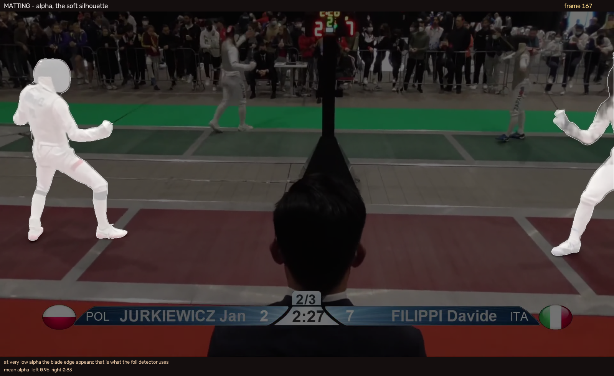
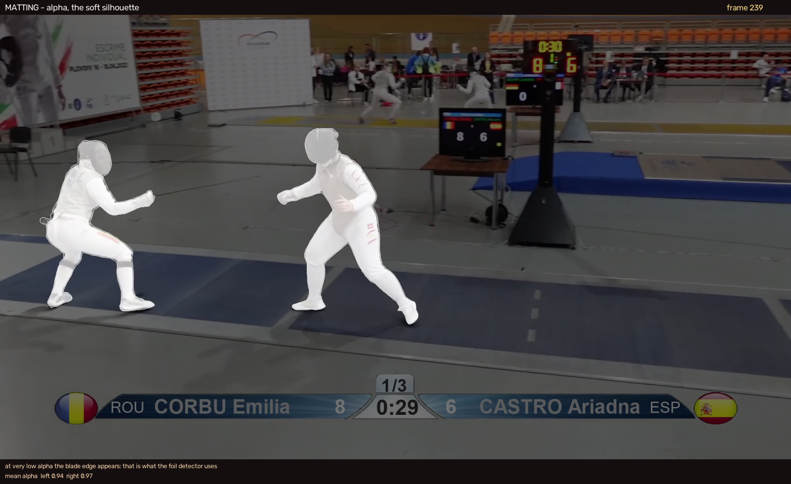

More stills, same layer: [BabyishIdioticCockerspaniel_c0302](media/matting_BabyishIdioticCockerspaniel_c0302.png) | [BabyishIdioticCockerspaniel_c0315](media/matting_BabyishIdioticCockerspaniel_c0315.png) | [proudDungBeetleBoglenTerrier_c0096](media/matting_proudDungBeetleBoglenTerrier_c0096.png) | [proudDungBeetleBoglenTerrier_c0163](media/matting_proudDungBeetleBoglenTerrier_c0163.png) | [proudDungBeetleBoglenTerrier_c0230](media/matting_proudDungBeetleBoglenTerrier_c0230.png) | [proudDungBeetleBoglenTerrier_c0334](media/matting_proudDungBeetleBoglenTerrier_c0334.png) | [uptightSlothEveningBat_c0146](media/matting_uptightSlothEveningBat_c0146.png) | [uptightSlothEveningBat_c0187](media/matting_uptightSlothEveningBat_c0187.png) | [uptightSlothEveningBat_c0227](media/matting_uptightSlothEveningBat_c0227.png) | [uptightSlothEveningBat_c0303](media/matting_uptightSlothEveningBat_c0303.png) | [uptightSlothEveningBat_c0362](media/matting_uptightSlothEveningBat_c0362.png)


- the footer prints the **mean alpha per side**. A near-zero one is not a bug in the video: `matting` returns background when a second person is inside the crop, and then that fencer's silhouette is empty. A null has to say it is a null and why

### 5 - POINTMAP: the depth-like channel we do NOT use

Shown because it was asked for, not because it is used. It is kept as a channel and the pipeline ignores it.

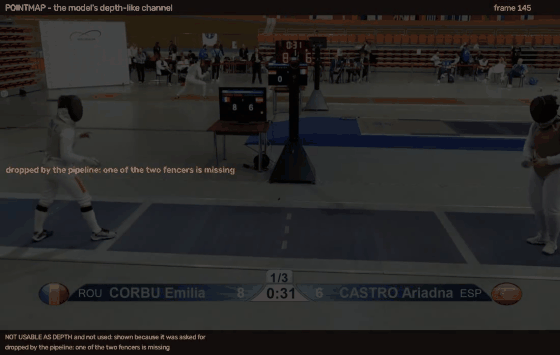

*8 s of the layer, 720 px. The MP4 below is the whole clip at full resolution - the GIF is here because GitHub does not play the video.*

<video src="https://huggingface.co/datasets/EXCALORIO/fencingly-datos/resolve/main/media/pointmap_BabyishIdioticCockerspaniel.mp4" controls loop muted playsinline width="100%"></video>

[pointmap_BabyishIdioticCockerspaniel.mp4 - MP4, 2.2 MB](media/pointmap_BabyishIdioticCockerspaniel.mp4)

<video src="https://huggingface.co/datasets/EXCALORIO/fencingly-datos/resolve/main/media/pointmap_proudDungBeetleBoglenTerrier.mp4" controls loop muted playsinline width="100%"></video>

[pointmap_proudDungBeetleBoglenTerrier.mp4 - MP4, 2.6 MB](media/pointmap_proudDungBeetleBoglenTerrier.mp4)

More clips, same layer: [uptightSlothEveningBat](media/pointmap_uptightSlothEveningBat.mp4)


Full-resolution stills:

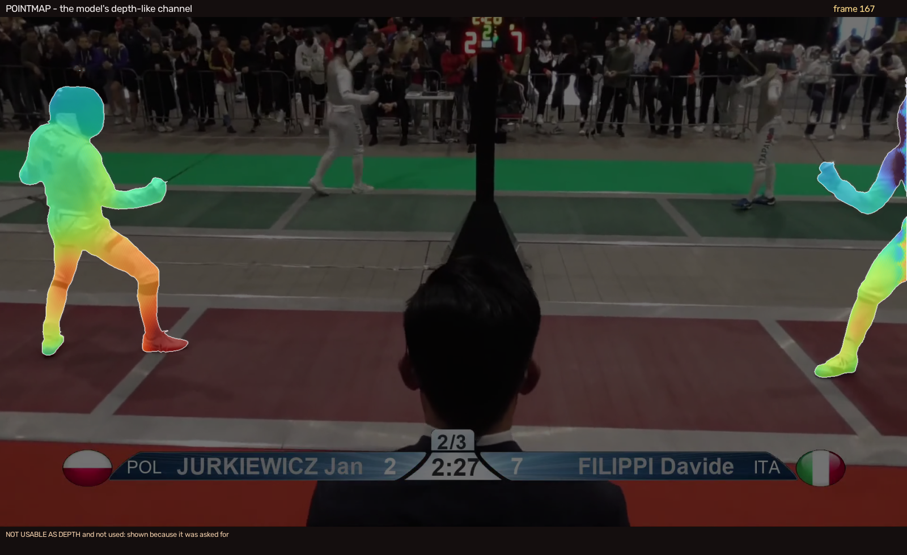
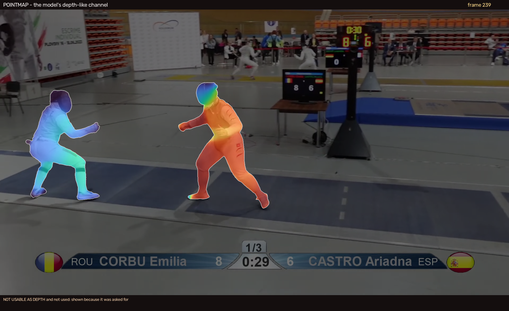

More stills, same layer: [BabyishIdioticCockerspaniel_c0302](media/pointmap_BabyishIdioticCockerspaniel_c0302.png) | [BabyishIdioticCockerspaniel_c0315](media/pointmap_BabyishIdioticCockerspaniel_c0315.png) | [proudDungBeetleBoglenTerrier_c0096](media/pointmap_proudDungBeetleBoglenTerrier_c0096.png) | [proudDungBeetleBoglenTerrier_c0163](media/pointmap_proudDungBeetleBoglenTerrier_c0163.png) | [proudDungBeetleBoglenTerrier_c0230](media/pointmap_proudDungBeetleBoglenTerrier_c0230.png) | [proudDungBeetleBoglenTerrier_c0334](media/pointmap_proudDungBeetleBoglenTerrier_c0334.png) | [uptightSlothEveningBat_c0146](media/pointmap_uptightSlothEveningBat_c0146.png) | [uptightSlothEveningBat_c0187](media/pointmap_uptightSlothEveningBat_c0187.png) | [uptightSlothEveningBat_c0227](media/pointmap_uptightSlothEveningBat_c0227.png) | [uptightSlothEveningBat_c0303](media/pointmap_uptightSlothEveningBat_c0303.png) | [uptightSlothEveningBat_c0362](media/pointmap_uptightSlothEveningBat_c0362.png)


- it orders the two fencers in depth correctly in **76 %** of frames - and the **y coordinate of the free foot**, which costs nothing, gets it right **100 %** (28 of 28)
- Sapiens 1 depth scored **73.2 %**, below the free baseline, on a newer model's predecessor
- the 3D cone is off for the same reason: negative Z in 11.4 % of one clip, implied field of view 21-144 deg where a fencing camera uses 8-30, and the 11 places where 2D and 3D disagreed were **noise** - permuting the depths at random reproduced them exactly


### 6 - FOIL: the threat cone, as a graded probability field

The cone is what turns *where the arm points* into *who can be hit*. It is **not** a flat wedge: the fill **is the weight function the measurement itself uses**, so the figure and the number cannot disagree. This project already lost a day to a visualisation that did not match its own data, so the drawing and the metric are now the same code.

The yellow cross is where **the two cones cross each other**. That is the test - cone against cone, not cone against torso.

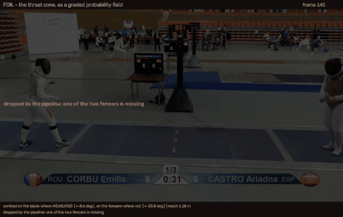

*8 s of the cone. The MP4 below is the whole clip at full resolution - the GIF is here because GitHub does not play the video.*

<video src="https://huggingface.co/datasets/EXCALORIO/fencingly-datos/resolve/main/media/foil_BabyishIdioticCockerspaniel.mp4" controls loop muted playsinline width="100%"></video>

[foil_BabyishIdioticCockerspaniel.mp4 - MP4, 2.7 MB](media/foil_BabyishIdioticCockerspaniel.mp4)

<video src="https://huggingface.co/datasets/EXCALORIO/fencingly-datos/resolve/main/media/foil_proudDungBeetleBoglenTerrier.mp4" controls loop muted playsinline width="100%"></video>

[foil_proudDungBeetleBoglenTerrier.mp4 - MP4, 3.7 MB](media/foil_proudDungBeetleBoglenTerrier.mp4)

More clips, same layer: [uptightSlothEveningBat](media/foil_uptightSlothEveningBat.mp4)


Full-resolution stills:

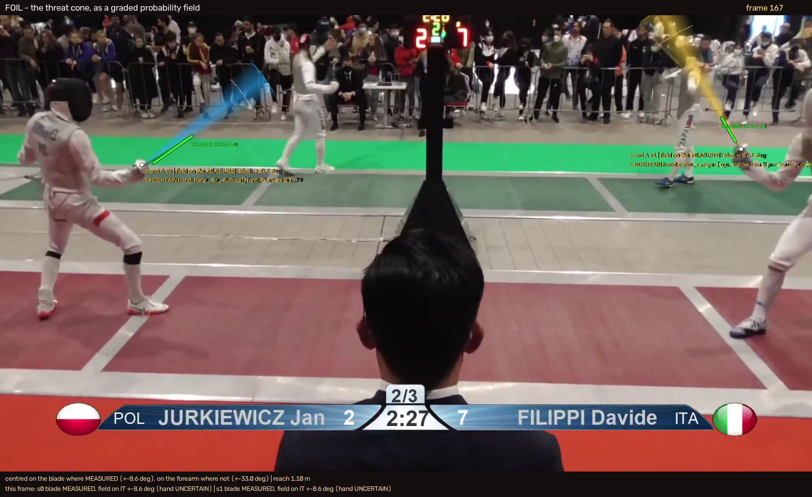
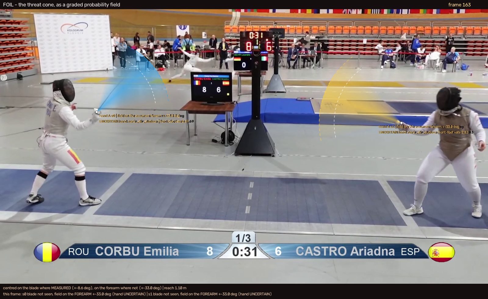
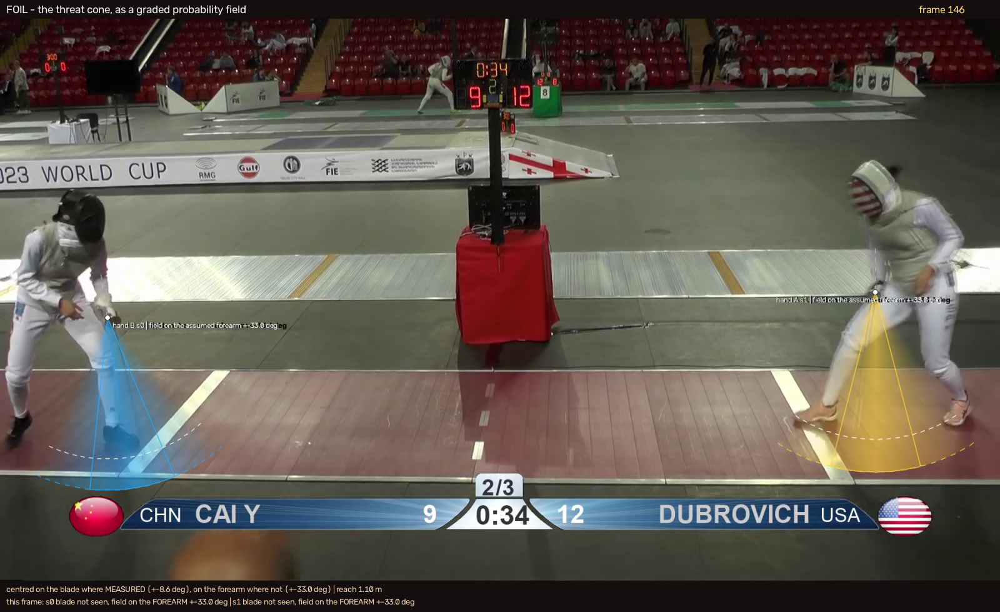

More stills, same layer: [BabyishIdioticCockerspaniel_c0302](media/foil_BabyishIdioticCockerspaniel_c0302.png) | [BabyishIdioticCockerspaniel_c0315](media/foil_BabyishIdioticCockerspaniel_c0315.png) | [proudDungBeetleBoglenTerrier_c0096](media/foil_proudDungBeetleBoglenTerrier_c0096.png) | [proudDungBeetleBoglenTerrier_c0230](media/foil_proudDungBeetleBoglenTerrier_c0230.png) | [proudDungBeetleBoglenTerrier_c0239](media/foil_proudDungBeetleBoglenTerrier_c0239.png) | [proudDungBeetleBoglenTerrier_c0334](media/foil_proudDungBeetleBoglenTerrier_c0334.png) | [uptightSlothEveningBat_c0187](media/foil_uptightSlothEveningBat_c0187.png) | [uptightSlothEveningBat_c0227](media/foil_uptightSlothEveningBat_c0227.png) | [uptightSlothEveningBat_c0303](media/foil_uptightSlothEveningBat_c0303.png) | [uptightSlothEveningBat_c0362](media/foil_uptightSlothEveningBat_c0362.png)


- reach **1.10 m** wrist-to-tip. A foil blade is **0.90 m** on its own, and the first version used exactly that - which is wrong for a *threat* radius, because the threat starts at the wrist and the guard and the hand add the rest. It looked too short and it was
- the axis is the **forearm**, `elbow -> hand root`. Using the hand axis instead put the cone more than 40 deg off in **63.6 %** of frames; the forearm brings that to **15.7 %**
- the arcs are **measured, not chosen**: solid = p50 core **+-14.4 deg half-angle (28.8 deg full)**, dashed = p90 envelope **+-33.0 deg half-angle (66.0 deg full)**, both from |detected blade - forearm axis| over 31 blades. Every angle here is written as *half and full*, on purpose: that undeclared convention already cost this project five contradictory figures in one day. Those two arcs are the pair for an **assumed** direction; where the blade was measured there is only one arc, at +-8.6 deg, because there is no measured p50 for that provenance and inventing one would be a third figure
- when a blade is actually **detected** the field is **centred on the measured blade itself** (`origen 0`) and narrows to **+-8.6 deg**, which is **3.8x** narrower than the +-33.0 deg it uses when the direction is only assumed. Centre and width are **one decision**, not two: the 33.0 is by definition the p90 of |blade - forearm|, so the moment the centre moves onto the blade that percentile no longer applies, and 8.6 is the p90 of what is left over
- **two figures on this page were wrong and are retired with their measurements**, because that is the only way a correction is worth anything. The **layer videos used to centre the cone on the forearm while the caption said it was centred on the measured blade** - in the frame a reader pointed at, the blade sat **21.4 deg** off the axis, outside the solid p50 core, and it was not a rare frame: **26 of 60**. And the width for a seen blade was published as **4.2 deg**, which is the frame-to-frame tremor of the blade's *direction* (70 pairs over 12 bouts, itself a correction of an earlier 14.0 from 8 pairs of one bout) - a real number, but **not** the width of a wedge whose apex is the hand: the detected blade line misses the hand root by 7 px median at only 0.24 of the reach, and a few pixels that close to the apex subtend many degrees. At 4.2 deg the cone **did not contain the blade it was centred on** in 21 of 60 frames. `temblor_hoja_gr` still ships, as its own field, because it measures something real - just not this
- **honest limit, broken down instead of pooled**: a blade line is found in **42.6 %** of crops at 1920x1080 and in **1.6 %** at 1280x720 - and **81 %** of the corpus is 720p. So most of the time the cone is a **geometric prior, not a detection**, and a single pooled percentage would hide which clips it is true for
- the thumb axis was tried as the blade direction and **failed**: lever arm of 2.4-4.8 px, jumps over 40 deg in 10-26 % of frames, against 0.9-2.1 deg for the forearm


### The piste: where each fencer is, in metres

This was rebuilt from scratch, because the first version had a defect worth stating plainly: **the origin was a convention, not a measurement**, so fencers appeared to start near the centre line when they do not. It now rests only on what the **rulebook** fixes, which is what makes it independent of the piste model.

Left: the 308-point skeleton with each fencer's position in metres. Right: the trace - position along the piste against time, which is the racing-line view. Bottom: the piste from above, to scale, with the regulation lines and the events appearing as they happen. The counter is there so the count can be judged frame by frame rather than taken on trust.


*12 s of the whole four-zone frame: skeletons and metres top-left, the label with the event underneath, the trace on the right, the piste from above along the bottom.*

The same thing zoomed into the two panels that carry the measurement, because at full frame their axis labels are too small to read:

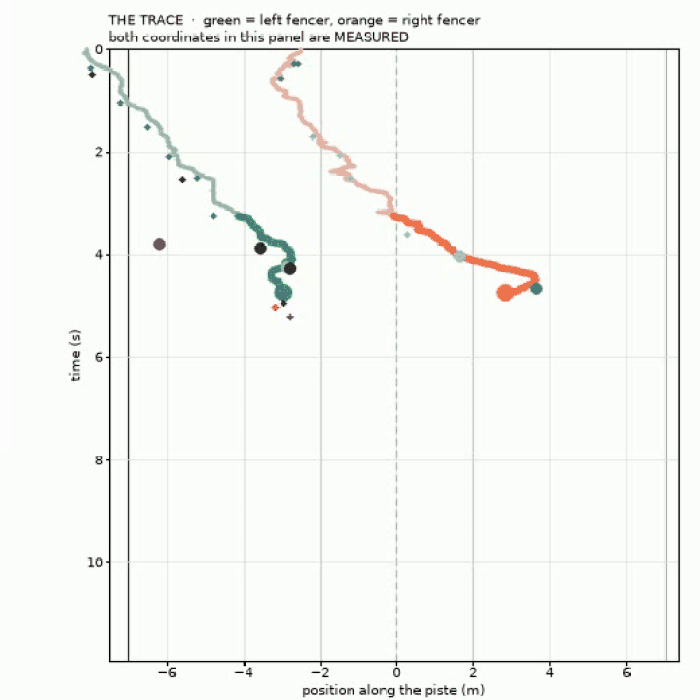

***The trace.** Position along the piste on the horizontal axis, **time** downwards. Green is the left fencer, orange the right. Both coordinates in this panel are measured: x by homography, time exactly.*

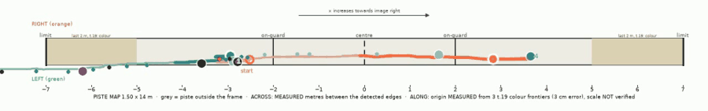

***The piste from above, to scale**, with the regulation lines. Each fencer is a thick dot, the trail behind is where they have been, and the events - march, retreat, lunge, halt - appear labelled as they happen.*

<video src="https://huggingface.co/datasets/EXCALORIO/fencingly-datos/resolve/main/media/trace_AbandonedBiodegradableCoqui.mp4" controls loop muted playsinline width="100%"></video>

[trace_AbandonedBiodegradableCoqui.mp4 - MP4, 1.0 MB](media/trace_AbandonedBiodegradableCoqui.mp4)


<video src="https://huggingface.co/datasets/EXCALORIO/fencingly-datos/resolve/main/media/trace_AdorableVeneratedDuiker.mp4" controls loop muted playsinline width="100%"></video>

[trace_AdorableVeneratedDuiker.mp4 - MP4, 5.7 MB](media/trace_AdorableVeneratedDuiker.mp4)


<video src="https://huggingface.co/datasets/EXCALORIO/fencingly-datos/resolve/main/media/trace_AliveIgnorantBarebirdbat.mp4" controls loop muted playsinline width="100%"></video>

[trace_AliveIgnorantBarebirdbat.mp4 - MP4, 9.1 MB](media/trace_AliveIgnorantBarebirdbat.mp4)


<video src="https://huggingface.co/datasets/EXCALORIO/fencingly-datos/resolve/main/media/trace_BountifulSilentEarwig.mp4" controls loop muted playsinline width="100%"></video>

[trace_BountifulSilentEarwig.mp4 - MP4, 9.0 MB](media/trace_BountifulSilentEarwig.mp4)


<video src="https://huggingface.co/datasets/EXCALORIO/fencingly-datos/resolve/main/media/trace_CautiousBeneficialLacewing.mp4" controls loop muted playsinline width="100%"></video>

[trace_CautiousBeneficialLacewing.mp4 - MP4, 7.4 MB](media/trace_CautiousBeneficialLacewing.mp4)


<video src="https://huggingface.co/datasets/EXCALORIO/fencingly-datos/resolve/main/media/trace_ForcefulAntiqueAlbacoretuna.mp4" controls loop muted playsinline width="100%"></video>

[trace_ForcefulAntiqueAlbacoretuna.mp4 - MP4, 8.9 MB](media/trace_ForcefulAntiqueAlbacoretuna.mp4)


<video src="https://huggingface.co/datasets/EXCALORIO/fencingly-datos/resolve/main/media/trace_GentleQuerulousElephantseal.mp4" controls loop muted playsinline width="100%"></video>

[trace_GentleQuerulousElephantseal.mp4 - MP4, 5.6 MB](media/trace_GentleQuerulousElephantseal.mp4)


<video src="https://huggingface.co/datasets/EXCALORIO/fencingly-datos/resolve/main/media/trace_HairyCourteousEarwig.mp4" controls loop muted playsinline width="100%"></video>

[trace_HairyCourteousEarwig.mp4 - MP4, 6.2 MB](media/trace_HairyCourteousEarwig.mp4)


<video src="https://huggingface.co/datasets/EXCALORIO/fencingly-datos/resolve/main/media/trace_IlliterateDisloyalFulmar.mp4" controls loop muted playsinline width="100%"></video>

[trace_IlliterateDisloyalFulmar.mp4 - MP4, 7.7 MB](media/trace_IlliterateDisloyalFulmar.mp4)


<video src="https://huggingface.co/datasets/EXCALORIO/fencingly-datos/resolve/main/media/trace_InsecurePettyCreature.mp4" controls loop muted playsinline width="100%"></video>

[trace_InsecurePettyCreature.mp4 - MP4, 8.4 MB](media/trace_InsecurePettyCreature.mp4)


<video src="https://huggingface.co/datasets/EXCALORIO/fencingly-datos/resolve/main/media/trace_SeparateHoarseFeline.mp4" controls loop muted playsinline width="100%"></video>

[trace_SeparateHoarseFeline.mp4 - MP4, 5.9 MB](media/trace_SeparateHoarseFeline.mp4)


<video src="https://huggingface.co/datasets/EXCALORIO/fencingly-datos/resolve/main/media/trace_TestyWatchfulBarebirdbat.mp4" controls loop muted playsinline width="100%"></video>

[trace_TestyWatchfulBarebirdbat.mp4 - MP4, 5.4 MB](media/trace_TestyWatchfulBarebirdbat.mp4)


<video src="https://huggingface.co/datasets/EXCALORIO/fencingly-datos/resolve/main/media/trace_UglyNiceAplomadofalcon.mp4" controls loop muted playsinline width="100%"></video>

[trace_UglyNiceAplomadofalcon.mp4 - MP4, 6.1 MB](media/trace_UglyNiceAplomadofalcon.mp4)


<video src="https://huggingface.co/datasets/EXCALORIO/fencingly-datos/resolve/main/media/trace_VibrantJoyousAsiaticgreaterfreshwaterclam.mp4" controls loop muted playsinline width="100%"></video>

[trace_VibrantJoyousAsiaticgreaterfreshwaterclam.mp4 - MP4, 5.5 MB](media/trace_VibrantJoyousAsiaticgreaterfreshwaterclam.mp4)


<video src="https://huggingface.co/datasets/EXCALORIO/fencingly-datos/resolve/main/media/trace_WastefulYawningAmericanquarterhorse.mp4" controls loop muted playsinline width="100%"></video>

[trace_WastefulYawningAmericanquarterhorse.mp4 - MP4, 2.8 MB](media/trace_WastefulYawningAmericanquarterhorse.mp4)


<video src="https://huggingface.co/datasets/EXCALORIO/fencingly-datos/resolve/main/media/trace_WholeTallAlpineroadguidetigerbeetle.mp4" controls loop muted playsinline width="100%"></video>

[trace_WholeTallAlpineroadguidetigerbeetle.mp4 - MP4, 7.9 MB](media/trace_WholeTallAlpineroadguidetigerbeetle.mp4)


At quarter speed, for judging the detection lag frame by frame: [AliveIgnorantBarebirdbat](media/trace_AliveIgnorantBarebirdbat_slow.mp4) | [ForcefulAntiqueAlbacoretuna](media/trace_ForcefulAntiqueAlbacoretuna_slow.mp4) | [GentleQuerulousElephantseal](media/trace_GentleQuerulousElephantseal_slow.mp4) | [UglyNiceAplomadofalcon](media/trace_UglyNiceAplomadofalcon_slow.mp4)

**What is measured now**, each with its own denominator, never pooled:

| | value | out of |
|---|---:|---|
| rectified strip obtained (both edges) | **20** | 22 clips |
| **origin MEASURED** from the t.19 colour frontiers | **13** | 22 clips |
| of those, unambiguous | **11** | 22 clips |
| of those, with redundancy, i.e. **controlled** | **5** | 22 clips |
| both fencers land on the piste (\|x\| <= 7.5 m) | **11** | the 13 anchored clips |
| **held-out landmark prediction error** | **p50 5 cm, max 8 cm** | 5 clips |
| lateral travel <= 0.60 m (the physical control) | **11** | 40 fencer-clips |
| clips where **both** fencers pass that control | **3** | 22 clips |
| lateral travel p50 / p90 / max | **0.75 / 1.63 / 3.33 m** | 40 fencer-clips |
| foot contacts falling outside the piste | **p50 2.7 %, max 23 %** | 20 clips |
| fencers crossing each other (physical control) | **0** | 20 clips |
| extra lateral plank detected | **0** | 22 clips |

The **5 cm** row is the one that matters: fit the anchor with two landmarks, predict a **third one it never saw**, and measure the miss. That is the independent control this part never had.

- **the origin is measured, the along-piste scale is not.** Three independent routes were tried and **none passes its own control**: painted lines by separation ratios (fits 14 of 20 clips, ambiguous in 10 of those 14, off by 1.3-2.6x against the reference), square pixels from the two ground vanishing directions (an exact camera solution that re-projects fencer heights of **0.4 to 4.9 m**), and colour zones (13 of 22, only 5 controlled). There is a **geometric** reason it is not a matter of tuning: two parallel lines with a known separation fix the scale **across** the piste everywhere and say **nothing** about the scale **along** it. So the map is labelled *origin MEASURED, scale NOT verified*
- **across** the piste is now metres between the two **detected** edges, bounded by construction. The earlier version assigned each fencer a fixed lane, so the one on the right always appeared glued to the right edge; that is gone
- the lateral coordinate is still **shape without scale**: travel of p50 **0.75 m** against a control of **< 0.60 m**, and in only **3 of 22 clips** do both fencers pass it. There is a physical reason: across the piste is the camera's **depth** direction, and a foot in the air projects displaced towards the background
- **there is more than one piste model, and here is the number**: of the 13 clips where the final zone is identified, **8 are darker** than the piste and **5 are lighter**. A detector that looked for grey would fail on more than a third of the corpus, so everything here detects a **colour change** and never a colour
- where there is no scale, the metric fields come out **None, not zero**. Writing zero would claim the fencer was standing on the centre line


### The movement events

March, retreat, lunge, halt, arm extension - one row per event, not per frame. This is the low-dimensional series the model is meant to learn from.

- **90 % recall**, and the confusion that mattered, **march mistaken for lunge, is 0**
- the discriminator is the **rear foot**: in a lunge the front foot flies and the rear foot **stays planted**. That binary property, not the distance, is what separates the two, and the ratio is measured **in the extension phase** and not over the whole window
- overlaps between different event types went from **73 to 0**, enforced by an assertion
- detection lag **+0.5 frames (+17 ms)** over 62 pairings, with no bias
- `balestra` and `jump` ship with **0 events**. The balestra was killed by ballistics: the 8.5 cm of rise it needs would require **7.9 frames of flight**, and the candidate events lasted one frame


### Which hand holds the weapon

What decides is a **cascade**, and its first rung is the rule that carries it: **in the on-guard stance the front foot is on the same side as the weapon arm** (FIE t.115.1). It is counter-intuitive and it is what works. If the front-foot vote is not firm, an on-guard-and-in-action gate takes over; what neither settles is flagged `uncertain`.

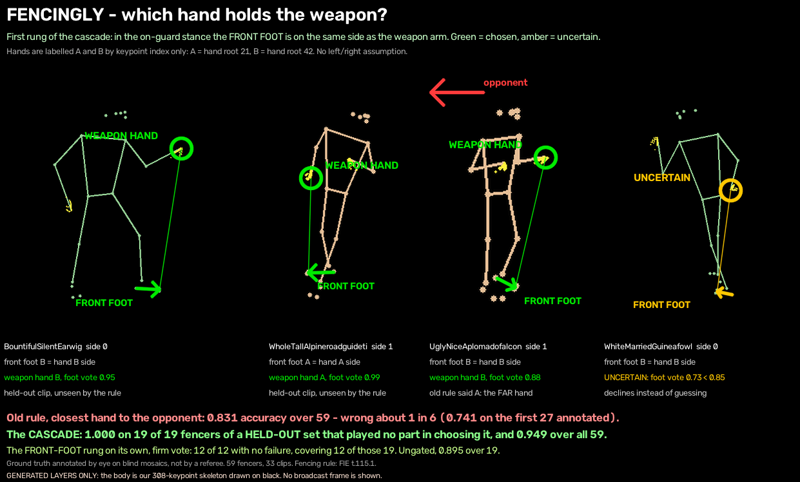

- **the cascade: 1.000 accuracy over 19 of 19 fencers** of a held-out set that played no part in choosing the rule, and **0.949 over all 59** fencers with ground truth
- **the front-foot rule on its own**, with a firm vote: **12 of 12 with no failure, covering 12 of those 19**. Ungated it scores **0.895 over 19** and 0.881 over 59. The 1.000 belongs to the cascade and the coverage to the rule, and they are not the same claim: an earlier version of this page merged them into one sentence
- the previous rule, *the hand closest to the opponent*, scored **0.831 over 59** - wrong about one time in six, and 0.741 on the first 27 annotated
- the glove was tried and **failed**: the whiteness feature reads the **sleeve** (pearson 0.681), and dark gloves exist. Paired separation **-0.002**, i.e. backwards
- what cannot be decided is flagged `uncertain` rather than guessed


### The open defect: sometimes one of the two fencers is the referee

In about **6 % of clips the pipeline delivers the REFEREE as one of the two fencers.** Four detection routes were tried and **all four failed, each with a number**:

| route | why it failed |
|---|---|
| uniform whiteness | the gold **lame** fires it on correct pairs; paired separation came out at **-0.002**, i.e. backwards |
| mask held in hand | with a loose threshold it becomes a darkness detector: fires on 469 of 3,386 patches while only 1 of 39 fencers holds a mask |
| geometry | the referee passed all three geometric gates **without touching them** (separation 1.93 of 3.20, foot delta 0.46 of 0.55, feet-in-band 0.894 of 0.40) - and it was predictable, because a referee walks beside the piste |
| movement behaviour | the referee scored **0.524** events per second, **above the p10 of real fencers (0.493)** and four times its own opponent's rate: walking arm-swing fires the arm-extension event |

Every row carries a `side_valid` flag and it is a **lower bound**. The reason this is hard is worth stating: **the referee's pose is perfectly good.** There is nothing wrong with the pose; what is wrong is *whose* it is. No pose-quality metric will ever catch it.


---

## Where each capability stands

Several of these are published as **not working**. That is deliberate: a field without its error is a
promise, and a capability without its failures is a brochure.

| capability | state |
|---|---|
| both fencers tracked, no intruders | **works** - median 100 % of frames, worst clip 91 % |
| always two poses, invented ones marked | **works** - 0 delivered frames without both |
| provenance of every point | **works** - and it is the part that cannot be recovered later |
| the five model channels | **works** - referee leakage 0.0000 |
| movement events | **works** - 90 % recall, `march -> lunge` confusion = 0 |
| weapon hand | **works on a held-out set** - the cascade 1.000 over 19 of 19; its front-foot rung alone covers 12 of those 19 |
| piste rectified from its two edges | **works** - 20 of 22 clips |
| **origin** on the piste, measured not assumed | **works where the colour frontiers are visible** - 13 of 22 clips, held-out landmark to **p50 5 cm** |
| scoring lights | **works** - 90.5 % with a per-venue region of interest |
| foil blade and threat cone | **partial** - the blade is found in **42.6 %** of 1080p crops but **1.6 %** at 720p |
| position **across** the piste | **partial** - metres between detected edges, but the physical control passes in only 3 of 22 clips |
| **scale along** the piste | **does NOT work** - three independent routes, none passes its own control, and there is a geometric reason |
| referee told apart from a fencer | **does NOT work** - ~6 % of clips, four routes failed |
| **right of way** (the goal) | **does NOT work** - 69.7 % against **73.8 % for never answering**, and beaten on both halves of the job |
| parry | **not implemented** - 0 annotated, blade contact not verifiable by eye in this material |
| depth from `pointmap` | **discarded with measurements** - the free `foot y` orders depth better |

### Parry - why there is nothing here

**0 parries annotated**, because blade contact turned out **not verifiable by eye** in this material:
of 16 blind plates, **zero** were decidable. Without ground truth there is nothing to measure
against, so there is nothing to ship. `halt` is **not** a parry: it means the fencer stopped moving.

---

## Scale of the data

| | |
|---|---:|
| clips in the corpus | 8,559 |
| clips with 308-point poses today | **732** |
| movement events extracted | **1,717** over 65 clips |
| frames per clip, median | 307 |
| resolution | 81 % at 1280x720, 18 % at 1920x1080, 0.8 % at 854x480 |
| cost, measured over 50 clips | **17.3 s/clip** to detect and pair (83 % of it the detector), plus **28 s/clip** for the four dense layers |
| over the whole corpus, on one GPU | **41 h** and **67 h** |

---

## The data table

### 1 - What comes out per clip, and in what shape

`T` is the number of frames in the clip; the `2` is the two fencers, side 0 on the image left and side 1 on the image right.

| field | shape on disk | what it is | format | measured precision |
|---|---|---|---|---|
| `KP` | `(300, 2, 308, 2)` | the 308 body keypoints of both fencers, in pixels | px, float32 | **2.26 px** torso error at 384x288 instead of 1024 (7.8x cheaper). **96.0 %** of delivered poses are MEASURED, not filled in |
| `SC` | `(300, 2, 308)` | per-keypoint confidence | 0-1, float32 | used with a 0.3 threshold. Points that fell outside their own person's box are zeroed: there were **10,140** of them and they sat on the other fencer |
| `origen` | `(300, 2)` | how the pose was obtained: 0 measured, 1 interpolated, 2 held, -1 none | code, int8 | **0 held poses** in what is delivered. Without this field the data cannot be weighted, and it **cannot be recovered later** |
| `hueco` | `(300, 2)` | length in frames of the gap an invented pose comes from | frames, int16 | **this row used to quote 2.2 % of torso length for any gap <= 24 frames, and that was wrong**: 2.2 % is the cost of a **1-frame** gap. Re-measured over the gaps that actually get filled, the whole <= 24 band costs **6.33 %** (n = 271), and a 24-frame gap costs **25.7 %**. Beyond 24 frames **there is no measurement at all** |
| `B` | `(300, 2, 4)` | each fencer's box, normalised 0-1, xyxy | fraction of frame, float32 | no delivered frame jumps more than **0.60 box widths** (worst measured 0.563). No box is a border sliver, and none comes from a track that was never seen whole |
| `Be` | `(300, 2, 4)` | ESTIMATED box: where the fencer should be in a frame the detector missed | fraction of frame, float32 | used only to aim a crop re-detection; its own error is not measured separately |
| `pres` | `(300, 2)` | whether that fencer's pose in that frame is MEASURED | bool | **0** delivered frames without both fencers, across 28 clips |
| `mask` | `(300,)` | usable frames: close-ups, replays and cross-fades removed | bool | a cross-fade is told from a zoom by the residual relative to contrast: **0.219 vs 0.062** |
| `filtro_vacias` | `()` | measured poses dropped for coming out empty | count, int32 | a pose with fewer than **20 useful body points out of 63** cannot serve as an anchor |
| `filtro_fuera_de_caja` | `(), in 21 of 732 files` | keypoints zeroed for falling outside their own box | count, int32 | **10,140** across 28 clips |
| `recortados_por_pose` | `(), in 21 of 732 files` | frames trimmed off the ends for not having both poses | count, int32 | **80** across 22 clips, which is what leaves **0 held poses** |
| `W` | `()` | video width | px, int | **81 %** of the corpus is 1280x720 |
| `H` | `()` | video height | px, int | 18 % is 1920x1080, 0.8 % is 854x480 |
| `T` | `()` | frames in the clip | frames, int | median **307**. The previous pipeline stored a **129-frame window**, not the whole clip |

### 2 - The five model channels kept per fencer

| channel | what it is | format | why it is there, measured |
|---|---|---|---|
| `pose` | 308 keypoints per fencer | (T, 2, 308, 2) float32 + (T, 2, 308) confidence | the index map is MEASURED: 5-6 shoulders, 7-8 elbows, 9-10 hips, 11-12 knees, 13-14 ankles, 15-20 feet, 21-41 hand A, 42-62 hand B, 63+ face. **245 of the 308 are face** and the project discards them, because fencers wear a mask |
| `seg` | body-part segmentation of each fencer | crop-sized uint8 class map | referee leakage into the mask measured **0.0000**. In the layer videos the channel is blended **inside the mask only** and the frame outside it is merely darkened, so you can check by eye that the mask landed on the right person and that nothing around it moved |
| `normal` | surface normals | crop-sized float16, 3 channels, NaN outside the mask | one axis per colour channel; the dense layer that **does** hold up for local geometry |
| `matting` | alpha, the soft silhouette | crop-sized float16, 0 outside the mask | at very low alpha the **edge of the blade** appears, which is what the foil detector uses. A near-zero mean alpha means matting returned background for that crop |
| `pointmap` | the model's 3D point map, z channel | crop-sized float16, NaN outside | **kept but not used**: it orders the two fencers correctly in **76 %** of frames, while the y coordinate of the free foot, which costs nothing, gets it right **28 of 28**. It ships because it was asked for, not because it works |
| `foil / campo` | the threat cone as a graded probability field | see `campo_*` above | the fill **is** the weight function the measurement itself uses, so the figure and the number cannot disagree. The grey dashes are the forearm and are drawn even when the field is centred on the blade, so you can see how far the field moved off the axis. A dashed core arc plus `UNCERTAIN` means the weapon-hand cascade could not settle that fencer, and the front-foot vote is printed next to it |

### 3 - The movement events: one row per event, not per frame

**1717 events over 65 clips** so far. Not published here as a file - the schema below is the contract, and the rows ship in batches of 500.

| column | what it is | format | measured precision |
|---|---|---|---|
| `clip / side` | which clip and which fencer (0 = image left, 1 = image right) | str / int | side 0/1 is an image convention, not left/right-handedness |
| `type` | march, retreat, lunge, halt, arm extension, action, jump | category | confusion matrix against gestures annotated by eye: **5 of 6**, with **`march -> lunge` = 0**. `jump` ships with **0 events**: not detectable here, and a ballistic assertion enforces it |
| `index_of_type` | the event's number within its own type and side | int | this is what makes *the third march of the right-hand fencer* a one-line query, and it is **the same number the video counter shows** |
| `frame_start / frame_end` | when the event starts and ends | frame, int | detection lag measured at **+0.5 frames (+17 ms)** over 62 pairings, with no bias. The **boundary error is still unmeasured**: that is what is being annotated now |
| `magnitude_m` | how far the fencer moved during the event | m, float | march p50 **0.346 m**, lunge p50 **0.565 m**. Depends on the piste scale, which is **not verified** along the piste |
| `x_start_m / x_end_m` | position along the piste | m from the centre line, float | the **origin is measured** from the t.19 colour frontiers in 13 of 22 clips, and a held-out landmark is predicted to **p50 5 cm**. The **scale** along the piste is **not verified**. Per-frame tremor p95 **0.025 m**, against 0.13-0.20 m/frame for a real lunge. Convention: **x grows towards image right** |
| `y_start_m` | position across the width of the piste | m, float | metres between the two **detected** edges, bounded by construction, so no fencer is pinned to an edge. But the physical control (travel <= 0.60 m) passes for **11 of 40 fencer-clips**, and in only **3 of 22 clips** do both fencers pass it |
| `no_homography` | whether this clip has no metric scale at all | bool | **6 in 10 clips** have none. When true the metric fields come out **None, not zero** |
| `razon_pie_atras` | rear-foot displacement over front-foot displacement | ratio, float | **the** march/lunge discriminator: boundary 0.45, measured in the extension phase and not over the whole window |
| `worst_pose_provenance` | the worst pose provenance any frame of the event rests on | code, int | an event resting on an interpolated pose is weaker, and here you can see it |
| `gap_beyond_measured` | whether the event uses a pose from a gap longer than 24 frames | bool | flags data whose error is **not** verifiable |
| `side_valid` | whether that side really is a fencer | bool | in **6.1 %** of clips the delivered side is the **REFEREE**, and **all four** detection routes tried have failed. This flag is a **lower bound** |
| `weapon_hand` | which hand holds the weapon: A (root 21) or B (root 42) | category | the **cascade** scores **1.000 over 19 of 19 fencers** of a held-out set that played no part in choosing the rule, and 0.949 over all 59 with ground truth. Its front-foot rung alone covers **12 of those 19, with no failure**. What cannot be decided is flagged `uncertain` instead of guessed |
| `campo_mu_gr / campo_sigma_gr / campo_origen` | the blade probability field: centre direction, width, and where it came from | deg, deg, code | `origen 0` = the blade was **SEEN**, so the centre is the **measured** blade angle and the half-angle is **8.6 deg**; `origen 1` = the centre is the **assumed** forearm direction and the half-angle is **33.0 deg**. Both are the p90 of a measured residual, so seeing the blade narrows the field **3.8x** and centre and width are one decision. `temblor_hoja_gr` (4.2 deg) is a different quantity and ships separately: the frame-to-frame uncertainty of the blade's **direction**, not the width of the field. They never merge: **a measured 1 and an assumed 1 are not worth the same** |


---

## This table **is** the training input

Everything above is the model's input. Not the video: **the series**.

Per clip and per fencer the model gets the 308-point pose with its provenance, the five channels, the
position along the piste where there is a scale, and the movement events as a row each - with their
type, their index, their start and end frame, their magnitude in metres, and the flags that say how
far each one can be trusted. The label to learn is **right of way**.

Which is why every row carries its **precision** and not just its name. Several are published as
**not usable yet**, and one - the referee - as a **known defect with a flag**, because a model trained
on data that hides its own defects learns the defects.

```python
ev.query("side == 1 and type == 'march' and index_of_type == 3")
```

returns the third march of the right-hand fencer: start frame, end frame, second, metres covered, how
long it took, and how much of it was measured rather than filled in.

---

## Honest limits

Figures come from **19 to 60 clips** depending on the measurement, **not** from the full corpus.

Ground truth for the weapon hand, for step counting and for blade contact **was built by eye inside
this project**, not by an FIE referee, and is kept in files so it can be contradicted.

Where a number appears twice on this page with two different denominators, that is deliberate: some
controls count **clips**, some count **fencers** and some count **frames**, and pooling them would
invent a figure that was never measured.

Four results in this project fell apart when the sample grew or when a control was finally written -
15/15 became 22/23, a feature changed sign on a bigger set, a blade dispersion went from 14.0 deg to
4.2 deg, and a **published accuracy turned out to belong to the whole cascade and not to the rule it
was credited to**. That is why criteria here are declared before measuring, samples are broken down
by bout and by venue before being aggregated, and **accuracy and coverage are never merged into one
sentence**.

---

## Fencing terms

| term | meaning |
|---|---|
| **march** / **retreat** | a step forward / a step backward |
| **lunge** | the explosive attack: the front foot flies and **the rear foot stays planted**. That binary property, not the distance, is what separates it from a march |
| **halt** | the fencer stops moving. **This is not a parry**, and the parry is not implemented |
| **right of way** | which fencer has priority for the touch |
| **valid target** | in foil, the torso. A **white light** means the tip landed **off-target** |
| **on-guard** | the basic stance; the **front foot is on the same side as the weapon arm** |
| **lame** | the conductive jacket that makes a valid touch register |

---

Source clips: **[FencingDatabase](https://fencingdatabase.com/)** - thanks to their team.

The extraction pipeline lives in a private repo (`EXCALORIO/fencingly-extraccion`, access on request).

Mirror of this page, same README and same videos: [github.com/EXCALOFRIO/FENCINGLY.AI](https://github.com/EXCALOFRIO/FENCINGLY.AI)
